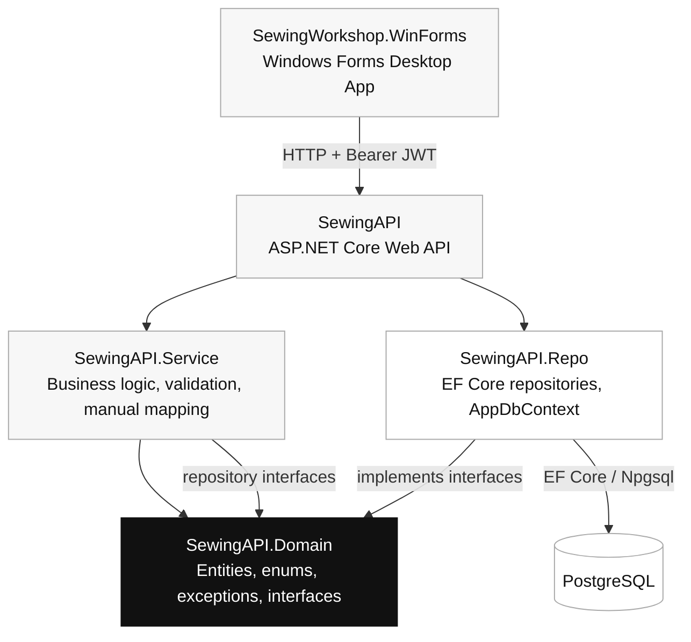
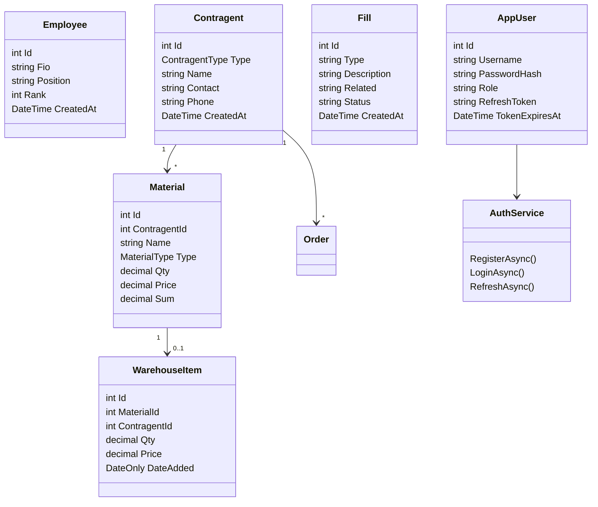
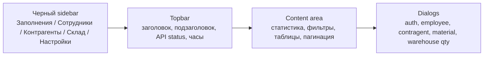

# Архитектура Sewing Workshop

## Проверка требований

| Требование | Где реализовано |
| --- | --- |
| JWT token | `SewingAPI/Program.cs`, `SewingAPI.Service/Services/AuthService.cs`, `SewingWorkshop.WinForms/Api/ApiClient.cs` |
| Пагинация | `SewingAPI.Service/DTOs/Shared/PagedResult.cs`, `SewingWorkshop.WinForms/Api/ApiModels.cs` |
| Ручной маппинг | `SewingAPI.Service/Mapping/*Mapper.cs`, `SewingWorkshop.WinForms/Mapping/ManualMapper.cs` |
| Валидация | `SewingAPI.Service/Validation/*Validator.cs`, `SewingWorkshop.WinForms/UI/Dialogs.cs` |
| Request/Response модели | `SewingWorkshop.WinForms/Api/*Request`, `SewingWorkshop.WinForms/Api/*Response`, API request/response модели |
| Слоеная / луковая архитектура | `Domain -> Service -> Repo -> API -> WinForms` |
| Отдельная desktop-программа | `SewingWorkshop.WinForms.sln`, `SewingWorkshop.WinForms/SewingWorkshop.WinForms.csproj` |

## Onion Architecture



## API Class Diagram



## WinForms Client Diagram

```mermaid
classDiagram
    class MainForm {
        ShowSectionAsync()
        LoadEmployeesAsync()
        LoadContragentsAsync()
        LoadWarehouseAsync()
        LoadFillsAsync()
    }

    class ApiClient {
        string BaseUrl
        string AccessToken
        LoginAsync()
        RegisterAsync()
        GetEmployeesAsync()
        GetContragentsAsync()
        GetWarehouseAsync()
        GetFillsAsync()
    }

    class ManualMapper {
        ToRow(EmployeeResponse)
        ToRow(ContragentResponse)
        ToRow(MaterialResponse)
        ToRow(WarehouseResponse)
        ToRow(FillResponse)
    }

    class AuthDialog
    class EmployeeDialog
    class ContragentDialog
    class MaterialDialog
    class QuantityDialog

    MainForm --> ApiClient
    MainForm --> ManualMapper
    MainForm --> AuthDialog
    MainForm --> EmployeeDialog
    MainForm --> ContragentDialog
    MainForm --> MaterialDialog
    MainForm --> QuantityDialog
    ApiClient --> "Request/Response models"
```

## UI Structure


